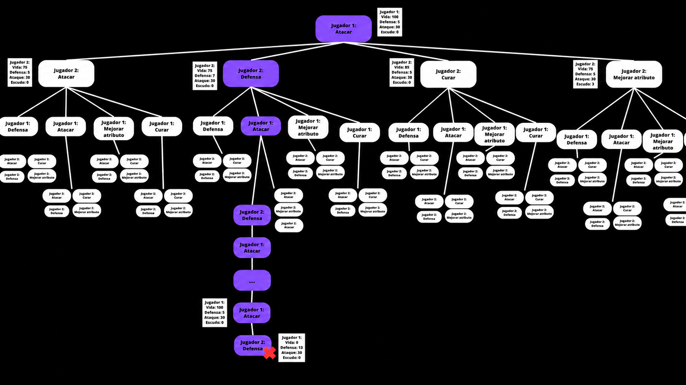
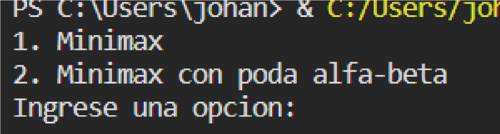
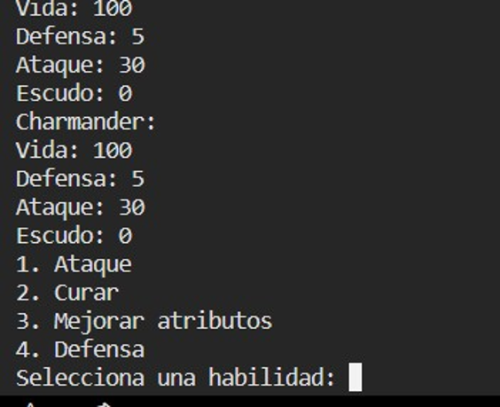
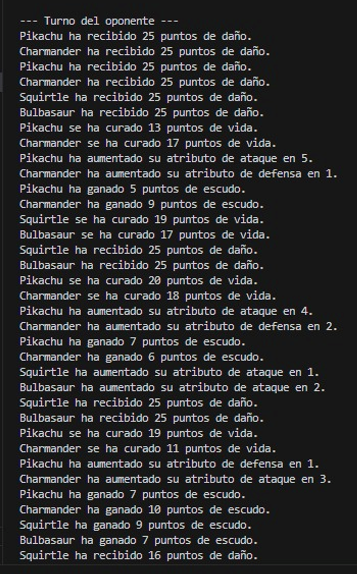
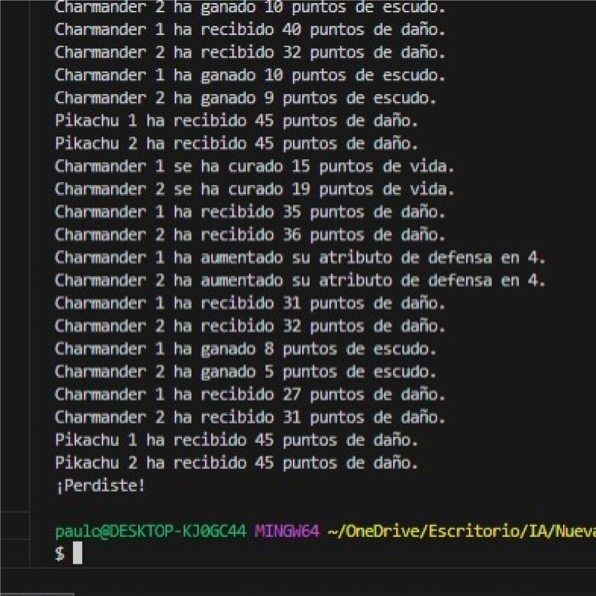

# ⚔️ Pokémon Battle AI - Minimax & Alpha-Beta


**Pokémon Battle AI** es un simulador de batalla por turnos inspirado en Pokémon, desarrollado en **Python**, donde se implementan y comparan dos algoritmos clásicos de inteligencia artificial: **Minimax** y **Poda Alfa-Beta**.

El objetivo del proyecto es analizar cómo estos algoritmos toman decisiones dentro de un juego de estrategia por turnos, evaluando acciones como atacar, curar, mejorar atributos y defenderse.

<p align="center">
  
</p>

---

## 📌 Tabla de contenido

- [Descripción](#-descripción)
- [Capturas del proyecto](#-capturas-del-proyecto)
- [Características principales](#-características-principales)
- [Tecnologías utilizadas](#-tecnologías-utilizadas)
- [Algoritmos implementados](#-algoritmos-implementados)
- [Mecánicas del juego](#-mecánicas-del-juego)
- [Habilidades disponibles](#-habilidades-disponibles)
- [Estructura del proyecto](#-estructura-del-proyecto)
- [Funcionamiento general](#-funcionamiento-general)
- [Modelo de datos](#-modelo-de-datos)
- [Flujo del programa](#-flujo-del-programa)
- [Cómo ejecutar el proyecto](#-cómo-ejecutar-el-proyecto)
- [Resultados esperados](#-resultados-esperados)
- [Documentación académica](#-documentación-académica)
- [Conceptos aplicados](#-conceptos-aplicados)
- [Mejoras futuras](#-mejoras-futuras)
- [Posibles mejoras técnicas](#-posibles-mejoras-técnicas)
- [Autor](#-autor)
- [Estado del proyecto](#-estado-del-proyecto)

---

## 📖 Descripción

Este proyecto consiste en un juego de consola basado en una batalla por turnos entre personajes inspirados en Pokémon.

El jugador humano controla un equipo de Pokémon y selecciona acciones durante su turno. El equipo oponente toma decisiones utilizando algoritmos de inteligencia artificial.

El sistema permite comparar dos enfoques:

- **Minimax**
- **Minimax con Poda Alfa-Beta**

El jugador puede elegir desde el menú qué algoritmo desea utilizar para la toma de decisiones del oponente. Durante la ejecución se muestran los atributos de los personajes, las habilidades disponibles, los efectos de cada acción y el resultado final del combate.

---

## 🖼️ Capturas del proyecto

### Menú principal

<p align="center">
  
</p>

El programa muestra un menú en consola donde el usuario puede elegir entre ejecutar el juego con **Minimax** o con **Poda Alfa-Beta**.

---

### Selección de habilidades

<p align="center">
  
</p>

El jugador selecciona la habilidad ingresando un número del menú de acciones. Las habilidades disponibles son ataque, curación, mejora de atributos y defensa.

---

### Registro del turno del oponente

<p align="center">
  
</p>

Durante el turno del oponente se imprimen las decisiones y efectos resultantes de la simulación de acciones, como daño recibido, curaciones, aumento de atributos y escudo.

---

### Resultado de ejecución

<p align="center">
  
</p>

El programa muestra las acciones realizadas hasta que uno de los equipos gana o pierde la batalla.

---

### Árbol de decisiones y mapa de estados

<p align="center">
  
</p>

Esta imagen representa el árbol de decisiones utilizado para visualizar posibles acciones, estados derivados y rutas dentro del combate.

---

### Vista compacta

| Menú | Habilidades |
|------|-------------|
|  |  |

| Turno del oponente | Resultado |
|--------------------|-----------|
|  |  |

| Árbol de decisiones |
|---------------------|
|  |

---

## ✨ Características principales

- Juego de batalla por turnos en consola.
- Inspirado en el universo de Pokémon.
- Implementado en **Python**.
- Comparación entre **Minimax** y **Poda Alfa-Beta**.
- Sistema de personajes con atributos.
- Sistema de habilidades.
- Turnos entre jugador humano e inteligencia artificial.
- Evaluación de estados del juego.
- Simulación de decisiones estratégicas.
- Menú para seleccionar el algoritmo.
- Uso de programación orientada a objetos.
- Código académico orientado al análisis de inteligencia artificial.
- Registro textual de acciones y resultados.
- Mapa visual del árbol de decisiones.

---

## 🛠️ Tecnologías utilizadas

- **Python**
- **Programación orientada a objetos**
- **Consola / Terminal**
- **Algoritmo Minimax**
- **Poda Alfa-Beta**
- **Simulación de juegos por turnos**
- **Funciones recursivas**
- **Evaluación heurística**
- **Visual Studio Code**

---

## 🧠 Algoritmos implementados

### Minimax

El algoritmo **Minimax** se utiliza para tomar decisiones en juegos de estrategia por turnos.

Su funcionamiento se basa en explorar posibles jugadas futuras y seleccionar la mejor decisión considerando que el oponente también jugará de forma óptima.

En este proyecto, Minimax evalúa diferentes habilidades disponibles y simula el comportamiento del juego para escoger una acción conveniente para el oponente.

---

### Poda Alfa-Beta

La **Poda Alfa-Beta** es una optimización del algoritmo Minimax.

Su objetivo es reducir la cantidad de nodos evaluados dentro del árbol de búsqueda, descartando ramas que no afectarán la decisión final.

Esto permite mejorar la eficiencia del algoritmo, reduciendo el tiempo de búsqueda y manteniendo un comportamiento similar al de Minimax.

---

## 🎮 Mecánicas del juego

Cada Pokémon tiene los siguientes atributos:

| Atributo | Descripción |
|---------|-------------|
| `nombre` | Nombre del Pokémon. |
| `vida` | Puntos de vida disponibles. |
| `defensa` | Reduce el daño recibido. |
| `ataque` | Daño base que puede causar. |
| `escudo` | Protección temporal contra daño. |

El juego se desarrolla en turnos. Primero juega el usuario y luego responde el oponente controlado por inteligencia artificial.

---

## ⚔️ Habilidades disponibles

Cada personaje puede utilizar una de cuatro habilidades por turno:

| Número | Habilidad | Descripción |
|-------|-----------|-------------|
| `1` | Ataque | Realiza daño al oponente. |
| `2` | Curar | Recupera puntos de vida. |
| `3` | Mejorar atributos | Aumenta ataque o defensa. |
| `4` | Defensa | Aumenta el escudo del personaje. |

El usuario selecciona la habilidad ingresando el número correspondiente en la consola.

---

## 📁 Estructura del proyecto

```text
pokemon-battle-ai-minimax/
│
├── README.md
├── main.py
│
├── assets/
│   ├── 01-menu-selection.png
│   ├── 02-skill-selection.png
│   ├── 03-opponent-turn-log.png
│   ├── 04-battle-result.png
│   └── 05-decision-tree-map.png
│
└── docs/
    ├── 1IL134_Grupo9_P3.pdf
    └── 1IL134_Grupo9_P3.docx
```

---

## ⚙️ Funcionamiento general

El programa inicia mostrando un menú:

```text
1. Minimax
2. Minimax con poda alfa-beta
Ingrese una opcion:
```

Dependiendo de la opción seleccionada, se ejecuta una versión diferente de la lógica de decisión.

Luego se muestra el estado de los Pokémon:

```text
Pikachu:
Vida: 100
Defensa: 5
Ataque: 30
Escudo: 0
```

Después, el jugador selecciona una habilidad:

```text
1. Ataque
2. Curar
3. Mejorar atributos
4. Defensa
Selecciona una habilidad:
```

El oponente responde utilizando el algoritmo seleccionado.

---

## 🧩 Modelo de datos

El proyecto utiliza una clase principal llamada `Pokemon`.

```python
class Pokemon:
    def __init__(self, nombre, vida, defensa, ataque, escudo):
        self.nombre = nombre
        self.vida = vida
        self.defensa = defensa
        self.ataque = ataque
        self.escudo = escudo
```

Cada instancia de `Pokemon` representa un personaje del juego con atributos propios.

---

## 🔄 Flujo del programa

```text
Inicio
  │
  ▼
Mostrar menú
  │
  ├── Opción 1: Minimax
  │       └── Ejecutar juego usando búsqueda Minimax
  │
  └── Opción 2: Minimax con Poda Alfa-Beta
          └── Ejecutar juego usando Alpha-Beta
  │
  ▼
Mostrar estado de los Pokémon
  │
  ▼
Jugador selecciona habilidad
  │
  ▼
Se aplica la acción del jugador
  │
  ▼
La IA evalúa el estado del juego
  │
  ▼
La IA selecciona una acción
  │
  ▼
Se repite el ciclo hasta que un equipo pierda
```

---

## ▶️ Cómo ejecutar el proyecto

### 1. Clonar el repositorio

```bash
git clone https://github.com/SalazarPaulo/pokemon-battle-ai-minimax.git
```

### 2. Entrar a la carpeta

```bash
cd pokemon-battle-ai-minimax
```

### 3. Ejecutar el programa

```bash
python main.py
```

En Windows también puedes usar:

```bash
py main.py
```

---

## 📊 Resultados esperados

El programa permite observar cómo se comporta la inteligencia artificial según el algoritmo seleccionado.

En general:

- **Minimax** evalúa todas las posibles jugadas hasta cierta profundidad.
- **Alpha-Beta** evita evaluar ramas innecesarias.
- Ambos algoritmos pueden tomar decisiones defensivas u ofensivas según la evaluación del estado.
- La partida termina cuando el equipo del jugador o el equipo oponente queda sin vida.

---

## 📚 Documentación académica

Este repositorio incluye documentación académica del proyecto en la carpeta `docs/`.

Archivos:

```text
docs/1IL134_Grupo9_P3.pdf
docs/1IL134_Grupo9_P3.docx
```

La documentación explica:

- El dominio seleccionado.
- El objetivo del proyecto.
- La teoría de Minimax.
- La teoría de Poda Alfa-Beta.
- El análisis de requerimientos.
- El desarrollo del prototipo.
- La implementación.
- Las pruebas realizadas.
- Los resultados.
- Las conclusiones.

---

## 🧠 Conceptos aplicados

Este proyecto aplica conceptos importantes de inteligencia artificial y programación:

- Programación orientada a objetos.
- Clases y métodos en Python.
- Simulación de estados.
- Juegos por turnos.
- Árboles de decisión.
- Algoritmo Minimax.
- Poda Alfa-Beta.
- Evaluación heurística.
- Recursividad.
- Copia de estados.
- Toma de decisiones.
- Entrada y salida por consola.
- Control de flujo.
- Simulación de combate.

---

## 🧪 Ejemplo de menú

```text
1. Minimax
2. Minimax con poda alfa-beta
Ingrese una opcion:
```

---

## 🧪 Ejemplo de habilidades

```text
1. Ataque
2. Curar
3. Mejorar atributos
4. Defensa
Selecciona una habilidad:
```

---

## 🧪 Ejemplo de estado de personaje

```text
Pikachu:
Vida: 100
Defensa: 5
Ataque: 30
Escudo: 0
```

---

## 🚧 Mejoras futuras

Algunas mejoras que se pueden implementar son:

- Agregar una interfaz gráfica.
- Permitir seleccionar diferentes Pokémon.
- Agregar más habilidades.
- Agregar tipos elementales.
- Agregar ataques críticos.
- Agregar probabilidad de evasión.
- Agregar sistema de niveles.
- Agregar selección de dificultad.
- Agregar más profundidad de búsqueda configurable.
- Mostrar estadísticas comparativas entre Minimax y Alpha-Beta.
- Medir tiempo de ejecución por algoritmo.
- Guardar resultados en archivo.
- Agregar pruebas automatizadas.
- Separar el código en módulos.
- Mejorar la función de evaluación heurística.

---

## 🔍 Posibles mejoras técnicas

- Dividir el programa en varios archivos:

```text
src/
├── main.py
├── pokemon.py
├── game.py
├── minimax.py
├── alpha_beta.py
└── utils.py
```

- Crear una carpeta para pruebas:

```text
tests/
└── test_game.py
```

- Agregar archivo de dependencias:

```text
requirements.txt
```

- Agregar medición de tiempo:

```python
import time
```

- Agregar comparación de rendimiento entre algoritmos.

---

## 👨‍💻 Autor

**Pedro Salazar**

---

## 📄 Licencia

Este proyecto fue desarrollado con fines académicos y de aprendizaje.

Si deseas reutilizar, modificar o distribuir este proyecto, se recomienda agregar una licencia formal al repositorio.

---

## 📌 Estado del proyecto

Proyecto académico finalizado.

El sistema permite ejecutar una batalla por turnos en consola y comparar la toma de decisiones de la inteligencia artificial utilizando **Minimax** y **Poda Alfa-Beta**.
